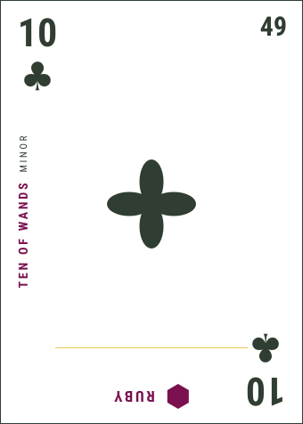
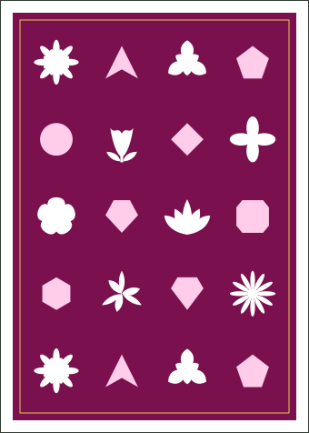

# Multipack

104-card deck encoding playing cards, tarot, flowers, and gems.

  
  

**Face**

- **Corners** — rank and suit, mirrored
- **Number** — 1–104, top right
- **Left rail** — tarot name and index (empty on silent cards)
- **Centre** — flower and rank
- **Foot** — gem mark and name, inverted

**Back** — flowers and gems checkered, no text.

## Scripts

- `npm run dev` — viewer (`/`, `/print`)
- `npm test` — encoding fixtures
- `npm run generate:mapping` — regenerate `src/deck/deck-mapping.json` / `.csv`
- `npm run generate:readme-images` — regenerate `docs/face.svg` and `docs/back.svg`
- `npm run export` — SVG faces + back in `export/`
  - `--dpi 300` scales by 2.205 (750×1050)
  - `--bleed 3mm` adds bleed outside the card box
- `npm run export:mpc` — MakePlayingCards pack in `export/mpc/`
  - 104 faces + back as 822×1122 PNG (300 dpi, 36 px bleed)
  - `multipack.pdf` is a 105-page proof; upload the PNGs
  - Product: Custom Game Cards, Traditional Poker, up to 108 cards
